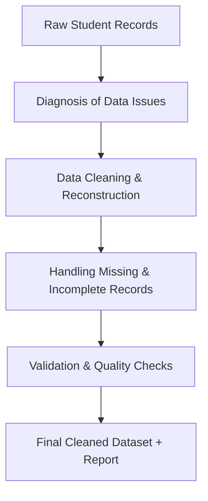

# 📊 Data Cleaning and Quality Assurance for Student Enrollment Records

## 📌 Project Overview
This project focuses on restoring **data integrity** within a corrupted student enrollment dataset.  
Errors were introduced during **manual data entry**, resulting in merged attributes, inconsistencies, missing values, and formatting errors.  

The objective is to **clean, restructure, and validate** the dataset, ensuring reliable student records for reporting and analysis.

---
        
## 🚨 Problem Statement
Student records contained:
- Multiple attributes merged into a single field.  
- Inconsistent identifiers across **Student_ID, Names, Dates, and Payments**.  
- Structural errors due to irregular delimiters.  
- Missing, incomplete, and duplicated records.  

These issues made the dataset **unreliable for decision-making and reporting**.

---

## 🎯 Objectives
- Diagnose and document **data quality issues**.  
- Clean and restructure corrupted student records.  
- Standardize formats across key fields (IDs, dates, categorical values, and payments).  
- Handle missing or unrecoverable records responsibly.  
- Deliver an **analysis-ready dataset** with supporting documentation.  

---

## 🔎 Scope of Work

### 1. Diagnosis of Data Quality Issues
- Misplaced, missing, and duplicated data across key fields:
  - `Student_ID`, `First_Name`, `Last_Name`, `Age`, `Gender`, `Course`, `Enrollment_Date`, `Total_Payments`  
- Structural errors identified:
  - Concatenated fields  
  - Inconsistent delimiters  

### 2. Data Cleaning & Reconstruction
- Extracted values from concatenated `Student_ID` fields.  
- Normalized `Age` and `Gender` for consistency.  
- Standardized **date formats** into ISO `YYYY-MM-DD`.  
- Cleaned financial data:
  - Removed currency symbols  
  - Converted to numeric format  

### 3. Handling Missing & Incomplete Records
- Records with **missing ID and Name** flagged as unrecoverable.  
- Recommendations provided for escalation to **Head of Enrollment Management**.  

---

## 📑 Deliverables
- ✅ Cleaned dataset (analysis-ready)  
- ✅ Data Quality Report:
  - Percentage of missing values  
  - Irrecoverable errors  
  - Recommendations for improving data capture  

---

## 📈 Workflow (Execution Flow)



---

## 🧪 Sample Work Executed

### Example 1: Fixing Inconsistent Dates
```sql
UPDATE students
SET Enrollment_Date = STRFTIME('%Y-%m-%d', Enrollment_Date);
```

✅ All dates standardized into `YYYY-MM-DD` format.  

---

### Example 2: Cleaning Payment Fields
```python
# Remove currency symbols and convert to numeric
df['Total_Payments'] = df['Total_Payments'].replace('[\$,]', '', regex=True).astype(float)
```

✅ Ensured payments are stored as **numeric values** ready for aggregation and analysis.  

---

### Example 3: Handling Missing Records
```python
# Identify unrecoverable records
unrecoverable = df[df['Student_ID'].isna() & df['First_Name'].isna()]
```

⚠️ Records with no `Student_ID` **and** `First_Name` flagged as irrecoverable.  

---

## 📊 Data Quality Report (Extract)
- Missing Values:
  - Student_ID → 3.5%  
  - Total_Payments → 5.2%  
- Duplicate Records → 1.8%  
- Irrecoverable Records → 1.1%  
- **Recommendation** → Implement validation checks at **point of entry**  

---

## 📬 Assistance Request (Original Communication)

> **Subject:** Assistance Required: Data Cleaning and Quality Assurance for Student Enrollment Records  
>
> Dear Analyst,  
> We are currently facing a significant data quality issue within our student enrollment records.  
> [...]  
> Kindly assist us in cleaning and validating the dataset to restore accuracy and reliability.  
>
> Best regards,  
> Head of Enrollment Management  

---

## ✅ Expected Outcome
- A **reliable, analysis-ready dataset** reflecting accurate student records.  
- A **comprehensive report** documenting all issues, fixes, and recommendations.  
- Enhanced processes for **future data capture**.  

---

## 📌 Author
👤 **[Your Name]**  
📧 Contact: [your.email@example.com]  
🏫 Institution: [Institution Name]  
