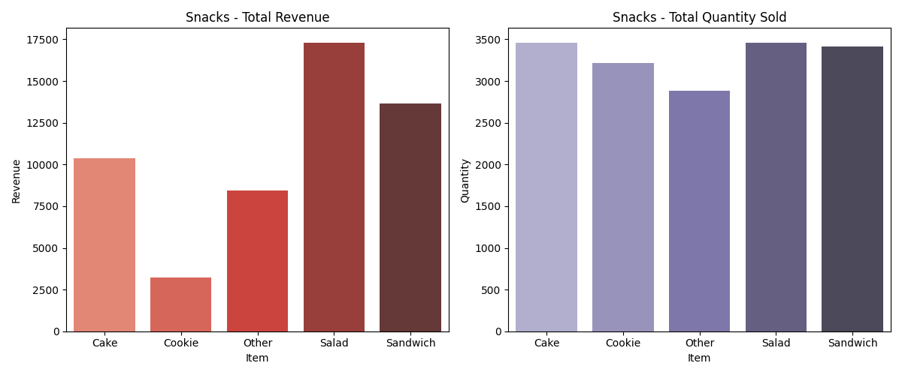

# Cafe Sales Data Analysis

## 1. Introduction
This project analyzes cafe sales data to identify key insights into item performance, revenue, and quantity sold. It focuses on understanding which items drive revenue, which are popular by quantity, and how Drinks vs Snacks contribute to sales.

## 2. Data Overview (Skimpy Report)
*(Insert Skimpy report here)*

## 3. Data Cleaning and Preprocessing
### 3.1 Data Cleaning Issues
| Column           | Issue                               | Solution                                                           |
|:-----------------|:------------------------------------|:-------------------------------------------------------------------|
| item             | Contains 'ERROR', 'UNKNOWN' values  | Replace errors with 'Other'                                        |
| quantity         | Missing values, partial or complete | Impute using total_spent / price_per_unit or remove if all missing |
| price_per_unit   | Missing values, partial or complete | Impute using total_spent / quantity                                |
| total_spent      | Missing values, partial or complete | Impute using quantity * price_per_unit                             |
| payment_method   | Contains 'ERROR', 'UNKNOWN' values  | Replace errors with 'Undefined'                                    |
| location         | Contains 'ERROR', 'UNKNOWN' values  | Replace errors with 'Undefined'                                    |
| transaction_date | Missing values                      | Fill missing dates with median date                                |

## 4. Data Exploration and Visualizations
### 4.1 Total Revenue by Item

### 4.2 Revenue vs Quantity

### 4.3 Drinks Revenue

## 5. Key Observations
- Revenue does not always correlate with quantity sold; e.g., Tea and Cookies have high quantity but low revenue.
- High-revenue items like Coffee and Smoothies also show high quantity sold.
- Drinks generally contribute more to total revenue than Snacks, but high-volume low-revenue items exist.

## 6. Suggested Strategies to Improve Revenue
- Price optimization for high-volume, low-revenue items.
- Promotions or bundling to increase revenue from popular low-revenue items.
- Pair time-series analysis with forecasting models to ensure the cafe is always stocked with high-demand items.

## 7. Next Steps / Further Analysis
- Customer Behavior Analysis by location and payment method
- Time-series trends to identify peak sales periods and seasonal patterns

## 8. Conclusion
The analysis provides insights into item-level performance, revenue contribution, and quantity sold. It highlights opportunities to optimize revenue and improve sales strategies for the cafe.
